Notes: This makedown file is exported from a presentation slides which Kevin Zhang gave a talk on Apr 8, 2019. The content will be updated frequently as the idea get more and more solid. The notes are based on Kevin's presentation. 

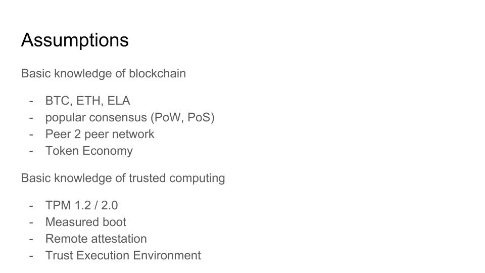

In today's talk, due the time limitation, I probably do not have enough time to go through all the basic concepts of Blockchain and Trusted Computing. I assume you already have known those basic concepts as prerequisites. If not, I can give a brief introduction deep enough to understand today’s main topic. For the readers online, please search in wikipedia to get the basic concepts before continue. 

We are different from other animals because we trade with others for mutual benefits.

We invented money, bank, financial system. We can even trade with ourselves of the future, such as loan. 

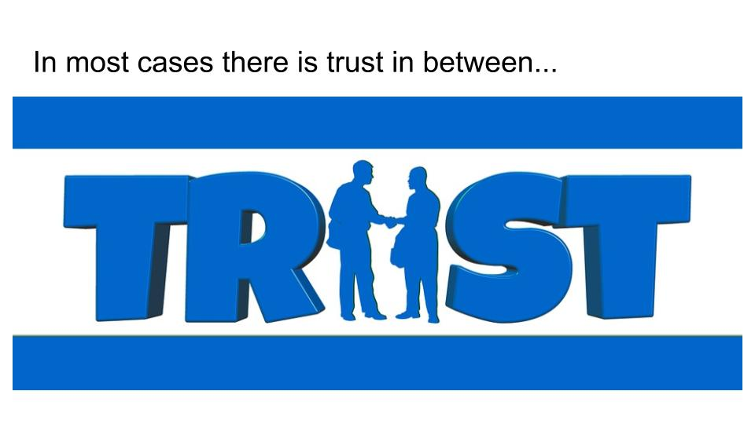
All of those are based on one the most fundamental factor, we call it "Trust". With the protection of trust, we know we what we gain and loss during the trade. 

If there is no trust ...... well, sometime it happens.

Originally, people can only trade with people they know, beause they can trust each other. Or through a common leader, eg. a tribal chief, a king, a governement. They have the centralized power to rule and enforce the trust. It works well as long as the scale is limited to relatively small society. So, until recent, almost all of our rules are based some sort of centralized system. A good center can keep the whole system running fairly and high efficiency...until it corrupts.

So people start to find a decentralized solution. One of the most well known experiments is “Bitcoin” and the technology behind “Blockchain”.

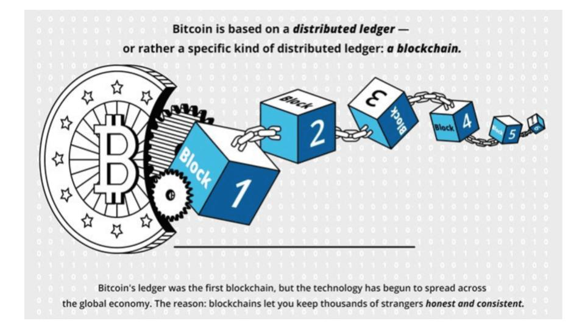
Bitcoin is based on a distributed ledger, so called “Blockchain”. It builds trust between trustless parties. The ledger can be considered a immutable time-based append-only distributed database.

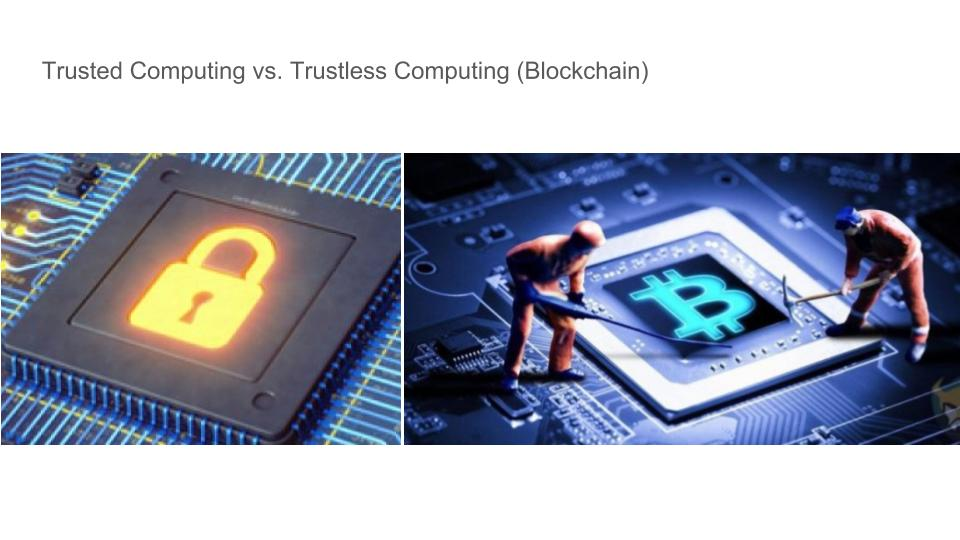
Blockchain and Trusted Computing are both solutions to solve the trustiness problem, but two very different directions.

Trusted Computing is trying to use technology (hardware, software) to guarantee integrity of system, make attacker very hard to hack technically

While on the other side, Blockchain is trying to use token economy and consensus to make attacker very expensive to attack compare with their benefits. Blockchain does NOT require nodes to trust each others, you are free to do whatever you want in your own nodes, but only follow the consensus can make you profitable. 
The first consensus is PoW used by Bitcoin for example. It is a public blockchain, anyone can use any kind of hardware to join bitcoin mining. You can do whatever in your machine, no others care about your security. As long as you can provide a Proof of Work (SHA256) faster than any others, they will follow your new block and you get reward. Bitcoin is not free of attack. As long as you own 51% hash power, you can actually control the Bitcoin. However, owning 51% of hash power is a mission impossible at this moment. 

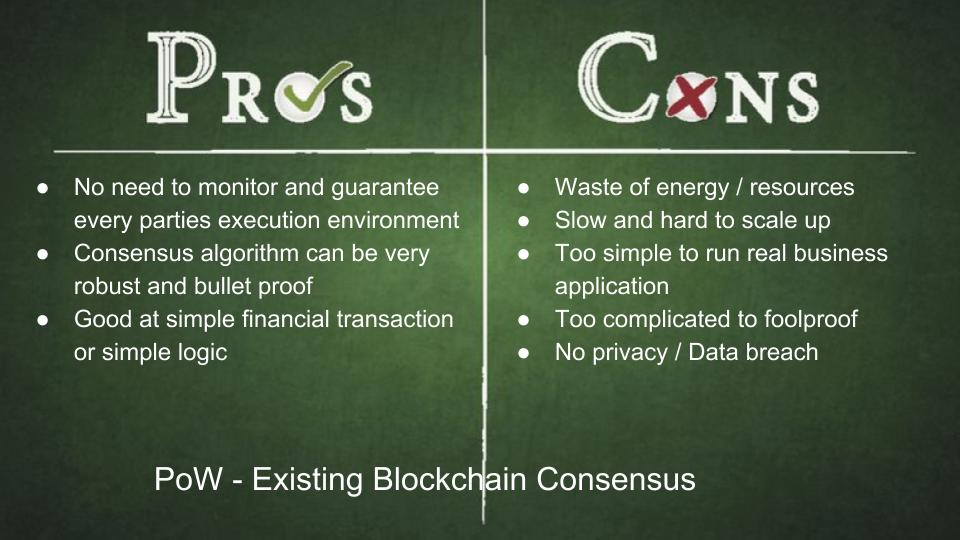

There are pros and cons of Blockchain.
By removing the requirement of trusting other nodes’ execution environment, blockchain allow almost everyone to join and min yet still very secure. On the other hand blockchain is slow, expensive and hard to compete with existing centralized solutions. 

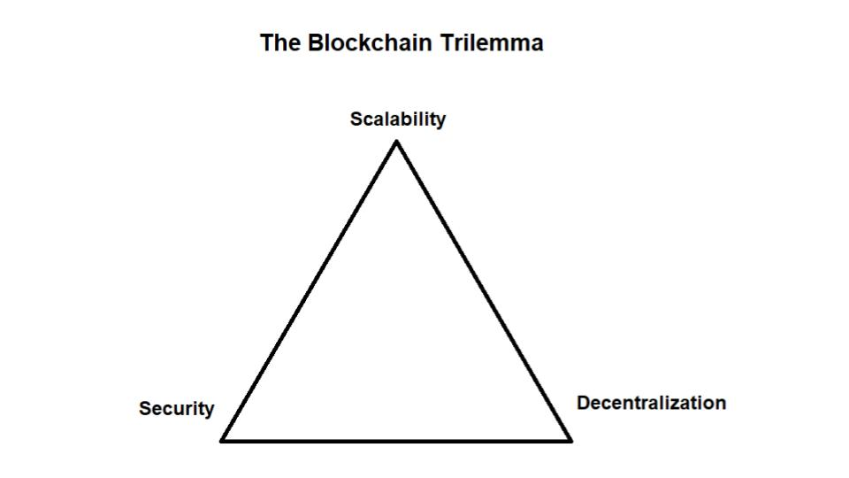
Recent years, there are many new blockchain projects are trying to solve the scalability problem, and some of them have made great progress. However, the Blockchain Trilemma is the physical pricinple we cannot overcome.

All of those issues are rules by the Blockchain Trilemma principle. 
You can only mostly get two of those three dimensions - “Scalability”, “Decentralization” and “Security”. For example, if you want to get both Security and Decentralization, you must compromise on Scalability. This is why Bitcoin is so slow, only about 7 TPS. Other blockchain projects can gain both Security and Scalability by compromising some of Decentralization. 
No one want to compromise Security, because everyone agree this is the most important dimension. But….

What if...

What if we “shift” the security load from the software consensus to hardware based trusted computing technologies. In this case, we actually did NOT compromise security, just use some existing Trusted Computing technologies to “take care of” security. In this case, the consensus can be much simple and faster, because it can care less about security and focus on scalability and decentralization.

We can actually get both scalability and decentralization without actually compromise security with only one new assumption: The Trusted Computing. 
This is how blockchain leverage the trusted computing. Let’s see how trusted computing can leverage blockchain in next slide

The benefits lay on both sides, Not only the Blockchain leverage Trust Computing. On the other side, Trusted Computing can also gain a lot of Blockchain.
Today’s Trusted Computing is heavily depends on TPM manufacture and very centralized too. Blockchain was born to be decentralized. We can store the ID key to the public distributed ledger. Every 2nd layer nodes are required to store their PCR and verification signature to the blockchain so that others can easily check the historical data and credit score. 
Because the blockchain is immutable. The data stored on the blockchain is trustable.

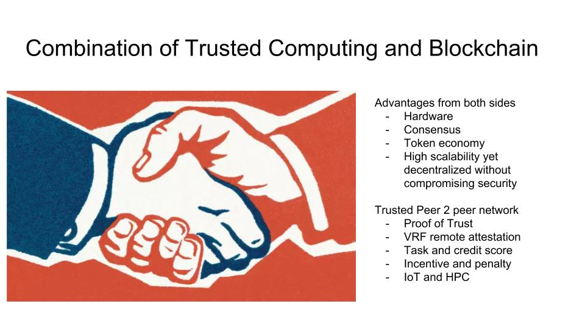
Both Blockchain and Trusted Computing can leverage from other side. 

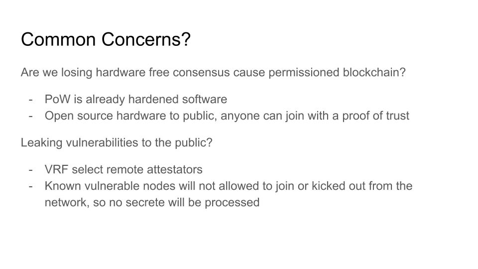

While gain so much, we cannot say we have nothing to lose. However there are something we can debate.

We will need some kind of hardware support because the root of trust is based on the TPM. If we cannot trust TPM, then the whole story makes no sense. Someone may say the original blockchain spirit is fair to everyone (PoW for example). But think this way, if you do not have a ASIC mining machine, how much chance you can beat those mining pool in the hash power competition? Price of electricity is also another core competition factor. I do not think it is a fair game any more. PoS? Yes, you know rich get richer rule, right?

On the other hand, the TPM and hardened software on chips could be very cheap in mass production. Everyone may get a chance to own and operate on one. What compete is no longer money and power consumption, but time and credit history. 

With the requirement on the hardware can we still claim to be permissionless? My opinion is as long as the protocol is open, the consensus is open. Every hardware manufacturer can join the competition, there won’t be any discrimination. It is still permissionless and open to public, as long as you can bring a valid proof of trust as anyone else did.

Because the PCR and other security related information will be stored to the blockchain, will it cause leaking vulnerability information?
Well, first, the data stored in blockchain is always encrypted, not plain text. Second, only VRF selected remote attestators can ask to get keys to validate those information. Without valid VRF proof, the verifiee can reject the remote attestation request. So not everyone has the right to access those security related information. On the other hand, if any node is detected untrustable, it will be kicked out from the p2p network, and will not get the chance to do valuable tasks. Only trusted node can access to valuable secured tasks.

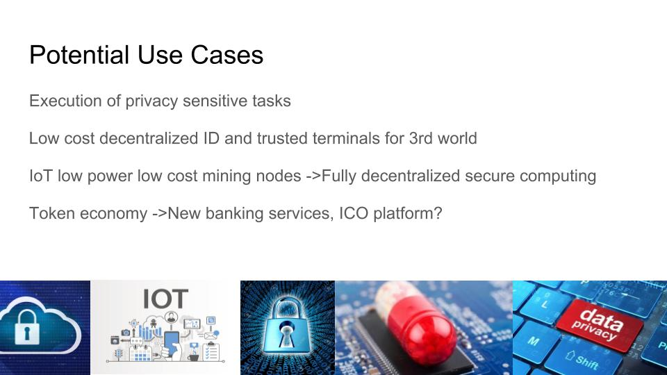

We will get to the detail case study at the end of our presentation. I would have some feature leaking first. Very brief.
Privacy protection. Blockchain itself has no privacy protection. All the computation is open. With the concept of digital capsule ( I will talk more about digital capsule later), we wrap sensitive data with self-execution code. The code will detect if it is running inside a trusted execution environment, If yes, it will ask key to unlock the data. This has to be done by trusted computing. 

If digital capsule can work, the digital media can be protected as well. Just like traditional DRM, but not purely rely on centralized DRM, but decentralized blockchain. I will talk more on this later.

The TPM can be very cheap when mass production, miners do not need expensive and power desire ASIC mining machine to min the Trusted Computing blockchain token. In the trusted computing world, we no longer need hash power to compete, instead we use time and credit history. Well behavior for long time can win at the last.

Those mining nodes can because a cloud, providing trusted computing services to enterprise. As reward, enterprise will need to pay token and miners win the token. It is a typical C 2 B business model. As long as trust is no longer an issue, well organized crowd can beat the monster.

Traditional blockchain cannot protect privacy. Ethereum smart contract is executed publicly in thousands of node to get consensus. In our system, consensus is separated from the execution of privacy sensitive tasks. The consensus is about if the execution node is trusted or not, nothing to do with the content of the task.

You can see the major differences between the traditional smart contract and our solution.

One of the reasons we use HPC is for digital capsule. 
The node (Raspberry Pi in our PoC) concern Proof of Trust. It does not run the digital capsule. HPC does. 

Digital capsule is one of the main services we can run on top of the trusted network besides typical smart contract.

Digital capsule is basically encrypted data wrapped by the execution code. The encryption is not inside the capsule. The wrapper code will be executed when digital capsule loaded into an execution environment. The code will retrieve information and logic via blockchain to determine if the execution environment is trusted or not. If yes, it will send the proof of trust to the data owner’s smart contract to get decryption key to unlock the data. Execution code may be part of the decrypted data and will be run once unlocked. 
If the wrapper code  or the data owner’s smart contract think the execution environment is not trusted, the capsule won’t be unlocked. 

[To be added...]

Low cost decentralized ID can solve many end-user related trust issue. 
For example, if you want to know if your charity donation actually reaches the people who really need help, not be taken by corrupted government?
Especially in the 3rd world countries, we are looking for a solution for low cost, trust ID for everyone. 
Not only the ID is trusted itself, but also use this ID to trust the device it connect to. For example to detect a fake ATM or malicious smartphone.

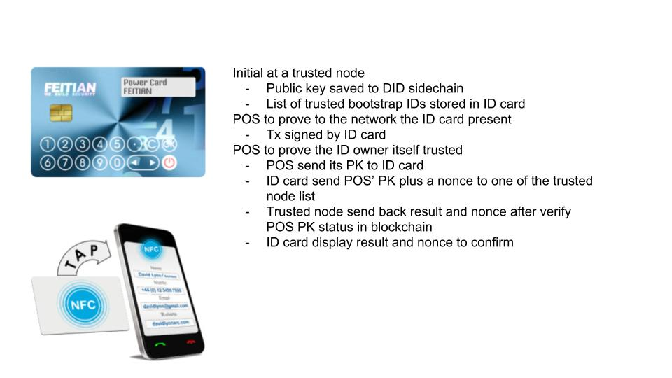
If the ID card has no UI, it is hard to determine if the connected terminals (ATM or Smart phone) are trusted or not.
The card need to be initialized from a trusted terminal first. This terminal store the ID card’s public key to the blockchain. The ID card will store a few “bootstrap” nodes’ public key which are considered to be trusted. Optionally, a OTOP can also be issued as a 2FA at this moment.

When the ID card connect to a unknown trustness terminal, it will connect to the P2P network via the terminal withou let allowing the terminal know any secrete. It get the terminal’s Proof of Trust from the blockchain instead of from the terminal directly. The user interface is very important in this case, otherwise, the card owner can be easily fooled by the UI displayed on the terminal, if that is the only user interface he can get.

The user interface on the card can be used to show OTOP, input and verify nonce, confirm transaction etc. Again, the user interface on the terminal cannot be trusted until the blockchain confirmed its Proof of Trust.

As long as we have enough nodes connected together, it will become a trusted world computer infrastructure. Just like a decentralized version of EC2, which not belonging to any company.

On top of this infrastructure, we can build the programming API that DApps running above.

As long as we can bring security, scalability and decentralization, major financial services can be running on this trusted world computing network. 
We can provide end to end or peer to peer financial services platform. ICO for World Bank etc.

Pretty cool? Let's move on to how we design this solution.

Before we get into the overview of our solution, let’s talk about the basic design principles and assumptions.

There is no such a 100% secure system, nor is this proposal. Actually this proposal is not intent to build a technical hard-to-attack system at all. The philosophy is not aiming hard to attack, but not worth to attack. This is the same philosophy as blockchain. As a public blockchain, the owner owns a node in their own location. The owner can actually do whatever he want to the node. However, there are several way to prevent
You are free to tamper your system, but TPM will report to the Layer2 verify node immediately through remote attestation. Once malicious behavior is confirmed by consensus, the smart contract in Layer 1 will forfeit the owner’s deposit and credit score. The node will be kicked out from the network and suspended for a while.
The credit score and deposit value is related to what value of task can be assign to this node. Low credit node can hardly get chance to execute a high value task.
The owner of a node has no knowledge about what tasks is current executed in his node. All the task assignment, remote attestator are randomly selected using VRF. Until the execution is completed and data is cleaned up, the information won’t be released to the public. Even if the attacker is one of the remote attestators, it is too short period of time to colute with others. Without knowing the content value, it is hard for attacker to attack every tasks because it will soon lose all his nodes and deposit.

We have a few assumptions. If any of those assumption not met, our solution may be vulnerable.

The TPM is the root of trust. We have to trust it and its manufacturer. If the TPM is not trustable, the whole chain-of-trust won’t be trustable either.
PBFT require less than ⅓ of nodes are malicious.
Nodes and nodes’ owners are rational. They want to be profit and hate losses.

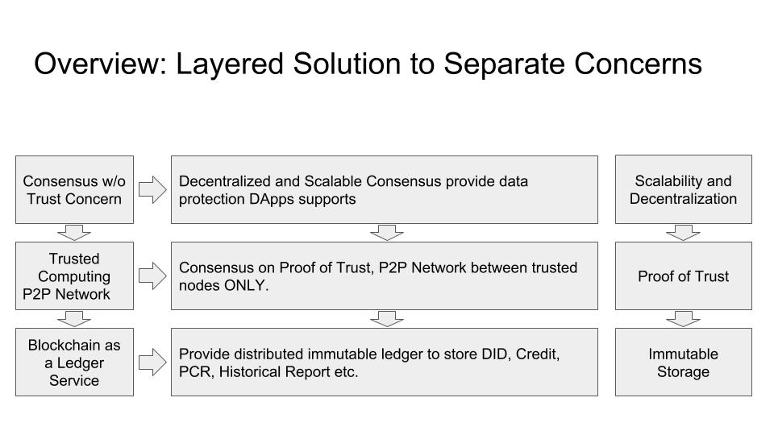
We can seperate the whole solution into 3 layers. 
The base layer is a typical blockchain. It can still run a traditional consensus like PoW to provide a secure trusted immutable ledger. We can store our Trusted Computing data into this ledger, for example, the ID Key for each TPM, Credit history for each node, PCR values etc.  In this case, we do not know anything about those above layers, we just consider they are just oracles. 

The middle layer is the Trusted Computing P2P network layer. This is the most important and most difficult part of the whole project. I will spend more time on this layer in the 2nd half of today’s talk. Briefly, it only allow trusted node to join the P2P network by verifying the new join node’s Proof of Trust by existing trusted nodes. The verification process is a Weighted PBFT consensus between already proved trusted nodes. New join node will need to provide a Proof of Trust from the TPM directly (including Measured Boot, TPM ID Key Certificate etc. more detail later). All the information will be stored in the first layer - the blockchain ledger layer. 

The verification is not a one-time-job, but a constant remote attestation instead. VRF (Verifiable Random Function) is used in selecting remote attestator. No one can predict when and who and what the remote an attestator comes from. Fail to pass the verification will cause kicked out from the network, reduce credit score and/or lost deposit. This is add additional difficulty and cost to attackers. 

The upper layer is a simplified consensus layer based on the assumption that all nodes are trusted. One of the example of this kind of consensus is PoET (Proof of Elapsed Time) used in HyperLedger SawTooth project. The current PoET in Sawtooth heavily depends on Intel SGX but we do not have to.

We will dive deeper into all three layers shortly. So let’s move on for now.

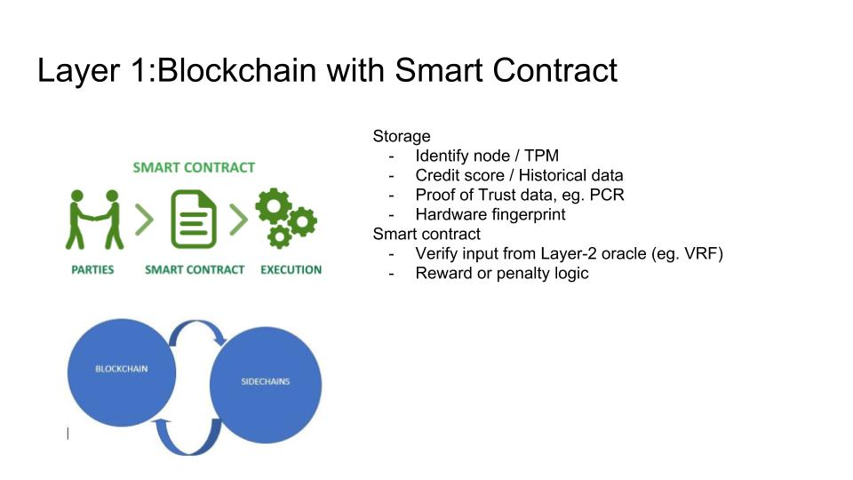
Layer 1 is pretty simple. No need to talk too much.
It is a typical smart contract blockchain. It could be a sidechain of a major public blockchain. Such as an Elastos sidechain, or simply an Ethereum smart contract.

Layer-2 is considered oracle to this base layer. Node of layer2 call transaction API to layer 1, layer 2 run smart contract and generate event back to layer 2.

Layer 2 is a semi-permissioned network. 
Any node can join the network as long as it can provide a “proof of trust” and pass the verification by existing trusted nodes. 
New node can use any kind of TPM chip, just need to follow the consensus. 

Once new node passed the test, it will become one of the “trusted” nodes and can gain credit score, also verify other new nodes.

Remote attestation is a continue, random process based on a rule defined by Verifiable Random Function. That means no one can predict when , who and how the next remote attestation will come. 

The consensus is “weighted” PBFT. That means the node has higher credit score will have higher voting power in the consensus. That makes sense become the higher credit score it owns, the more work it has done in the history, and more unlikely to be malicious (higher cost if caught by RA).

 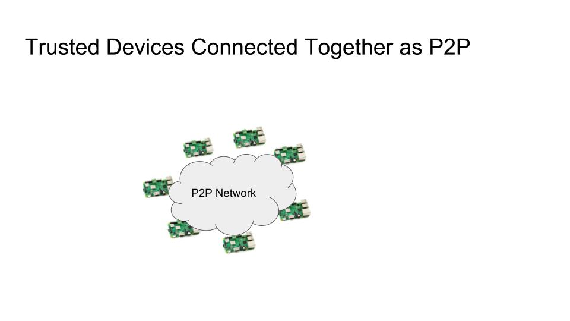

Any kinds of node can become part of the Trusted P2P network. However, in our PoC, we will chose low power IoT devices as our node. The reasons are
We want to prove that low cost low power devices can do as good as more expensive Intel SGX
The small device can get used to boot larger more power High Performance PC and use as the Root of Trust for those HPC. So that we can get HPC join the trusted network without major modification. Digital Capsule eventually need to be executed in HPC not IoT devices
The IoT device can be replaced by customized RISC-V TPM module if the experiment to be successful

In our PoC we plan to use Elastos Carrier as P2P network. It is robust, easy to modify open source network. And free of charge at this moment.

Elastos carrier started running since Q1, 2018. By the end of Jan 2019 we already got 1 M nodes running. Our trusted P2P network will be a modified version of Carrier with permission feature built in. It will not compatible with existing Carrier network but can be running on top of it.

![Connect HPC] ](images/Blockchain_Trust_Computation_and_New_Internet_Apr_2019_31.jpg)

The Raspberry Pi is a low power IoT device. They are power enough to run consensus and basic smart contract, but won’t run AI model training or complicated digital capsule tasks. Therefore we introduce the HPC (High performance PC) to connect with Raspberry Pi. The Pi will be the HPC’s root of trust, and control the boot image via PXE, measured boot and hardware fingerprint via an agent app running at root level. 

The chain of trust inside a single node is  TPM -> Raspberry Pi -> HPC
The final trust is decided by the consensus of trusted nodes using weighted PBFT

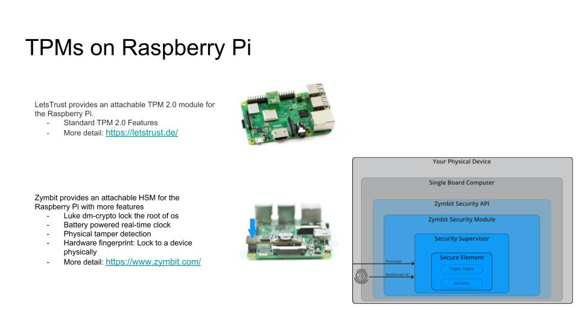
There are two modules I found fits Raspberry Pi.
LetsTrust and Zymbit

We have an assumption to trust those TPM for this Proof of Concept experiment. In the future, we should consider to build RISC-V based open source TPM. Besides we build TPMs ourselves, more important we open source to the public, everyone can build compatible TPM and keep it open sourced. 

One of the most challenged part is how we can use low powered Raspberry Pi to guarantee the truthfulness of a more powerful HPC. 

The HPC starts like a diskless workstation. The HPC doesn’t contains OS. It will boot from the RPi either using PXE, or using USB boot image from RPi. 

In these two cases, the RPi can run a PXE server to serve a certified known-hash boot image, or server as a USB thumb drive to start HPC from the image in the RPi Zero. RPi Zero is the smallest version of RPi, it can be put inside a USB Thumb drive housing. 

Everytime it boots, RPi will generate a nonce in the image, so the the Measure Boot will record a different hash of the OS in PCR. So that replay and man-in-the-middle attack will be much harder. The nonce and the hash will verified by the RPi after boot, and also be provided to remote attestator to verify the boot is secure. 

The HPC boot OS is a modified version of minimized Linux (or Windows). Because we load all the OS and code/data (digital capsule) from RPi, we only need HPC’s CPU, RAM, Hard drive as temporary storage. All the I/O driver can be removed except those I/O port RPI is connected to. We also embed an Agent app in the OS, so that it will start automatically when OS starts, it will connect to RPi and work with HPC’s TPM to collect security information to RPI, finally to the P2P network remote attestation to verify. 

One of the most challenged part is how we can use low powered Raspberry Pi to guarantee the truthfulness of a more powerful HPC. 

The HPC starts like a diskless workstation. The HPC doesn’t contains OS. It will boot from the RPi either using PXE, or using USB boot image from RPi. 

In these two cases, the RPi can run a PXE server to serve a certified known-hash boot image, or server as a USB thumb drive to start HPC from the image in the RPi Zero. RPi Zero is the smallest version of RPi, it can be put inside a USB Thumb drive housing. 

Everytime it boots, RPi will generate a nonce in the image, so the the Measure Boot will record a different hash of the OS in PCR. So that replay and man-in-the-middle attack will be much harder. The nonce and the hash will verified by the RPi after boot, and also be provided to remote attestator to verify the boot is secure. 

The HPC boot OS is a modified version of minimized Linux (or Windows). Because we load all the OS and code/data (digital capsule) from RPi, we only need HPC’s CPU, RAM, Hard drive as temporary storage. All the I/O driver can be removed except those I/O port RPI is connected to. We also embed an Agent app in the OS, so that it will start automatically when OS starts, it will connect to RPi and work with HPC’s TPM to collect security information to RPI, finally to the P2P network remote attestation to verify. 

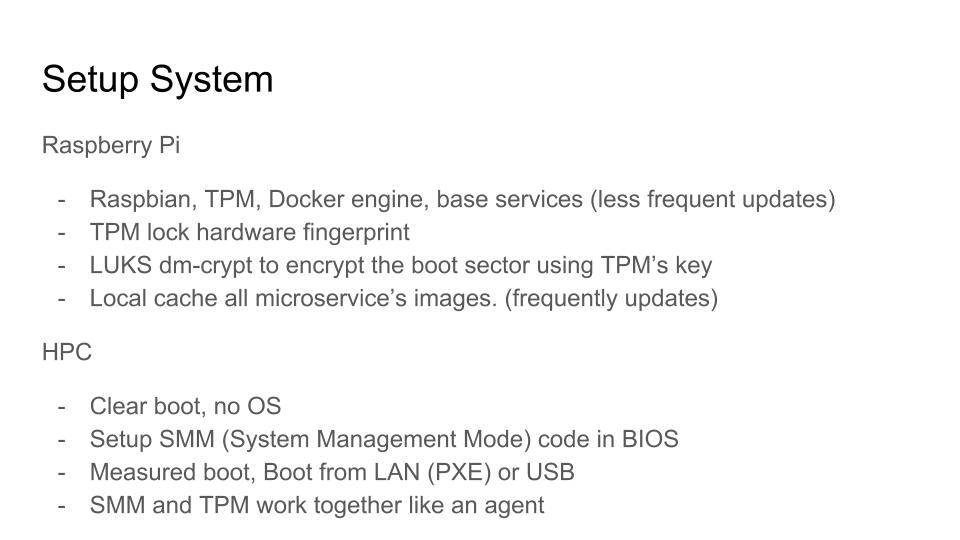
Setup the system for RPi and HPC

RPi boot sequence

Please reference the Measured Boot section
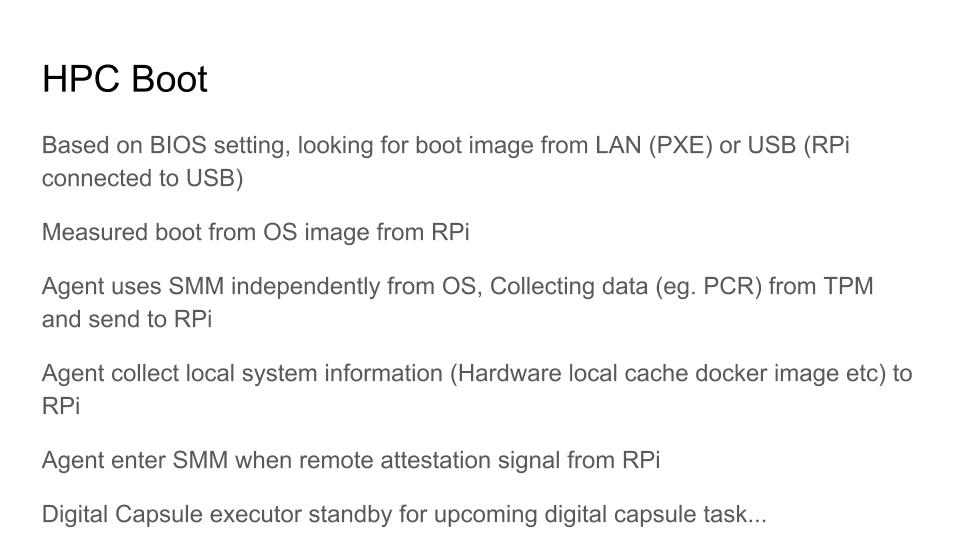
HPC boot sequence

P2P network remote attestation

VRF Credit Score and token economy

PoET: Proof of Elapsed Time.

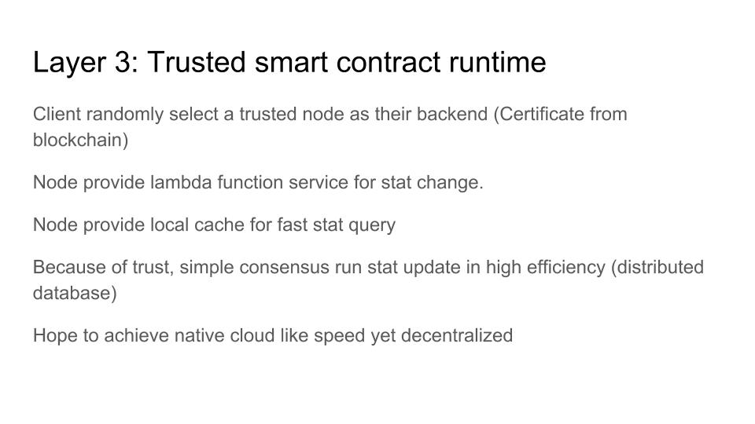
Smart contract runtime without trust concern

About the proof of concept project
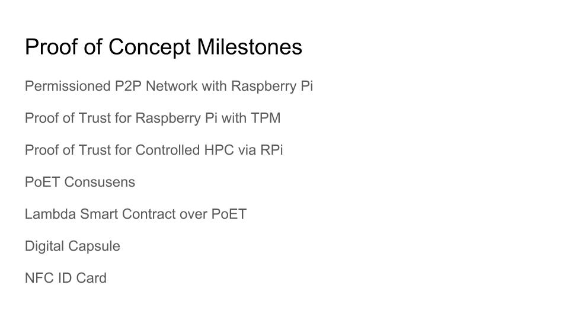
Milestones
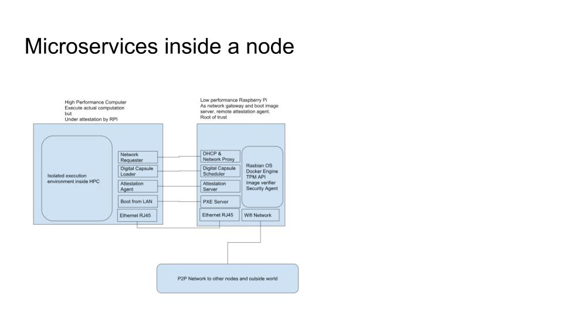
Microservices used in our POC
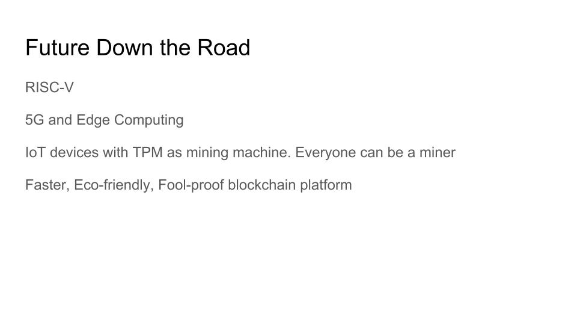
Future down the road

FAQ:

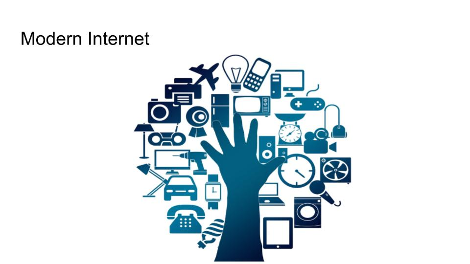

