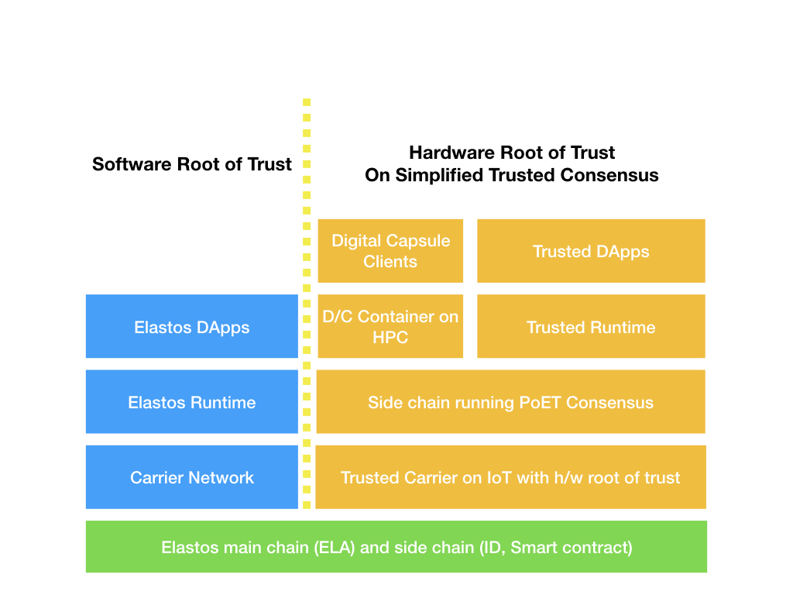

# A Trust Enhanced layer-2 Solution Based on Existing Elastos Platform

Traditional Elastos DApps and Trusted DApps stacks are two branches grown from the same root: Elastos blockchain.

Trusted stack is more complex then the traditioanl by adding additional layers focus on Trusted Computing. 

The traditional elastos RT also provide trusted features but based on software. The trusted domain require hardware root of trust for additional security. Further more, because of the hardware based trust root, the trusted domain can build a new type of sidechain using simplified consensus (eg. PoET) which depends on trusted hardware. Therefore it can reach much higher scalability yet lower cost. No PoW mining required!

## Traditional Elastos DApp

The common base layer is Elastos main chain and side chain. It provides basic blockchain trust using AuxPoW from Bitcoin.
The Elastos side chains provide ID and smart contract (compatible with ETH and NEO). Those two side chains will be used by Trusted stack as basic services.

Elasots Carrier Network is a peer to peer network connecting nodes. Elastos Runtime provide software guarded trust platform. DApps will be running in the Runtime with trusted environment

## Trusted Carrier on IoT with hardware root of trust

Different from traditional Carrier network, the trusted counterpart is not a permissionless. It requires the new join node to provide kind of "proof of trust" before allowed to join the network. The "proof of trust" are issued by any kind of TCG 1.2/2.0 certified TPM chips. The weighted PBFT consensus will be used by VRF selected validators to judge the proof of trust. 

Not only happened once, the remote attestation will be constant between nodes at a VRF random base. All the signature and validation will be done at the layer-1 Elastos smart contract sidechain. 

Trusted carrier nodes can trust each other and no more complex consensus needs between those trusted nodes.

## Sidechain running PoET Consensus

Because the trust is guaranteed by hardware based consensus, there is no need to run traditional complex consensus between those trusted nodes. We plan to use PoET (Proof of Elapsed Time) to get a faster, lower cost yet high scalability sidechain on top of traditional Elastos mainchain.

Because there is no more computational intensive "work" to be "proved", we plan to run the consensu between low power IoT devices instead of PC or special purpose mining machines.

## Digital Capsule (D/C) Container on HPC

As mentioned above, there is no need to run Trusted Carrier node using powerful machine, so IoT devices should be powerful enough. However, if there were digital capsules which require pretty much computational power to be executed, how are we going to handle it? We have the HPC connected and monitored by the trusted node to do the job.

In this case, the IoT node will be come the roof of trust. The HPC (High performance PC) is controlled by the node and guaranteed to work faithfully. 

## Trusted Runtime

Digital capsule is one kind of trusted internet use cases, more common use cases would be similiar to traditional cloud applications. Client send request to a trusted server and server response to the client. We plan to have a trusted runtime to fit this requirement.

A client (could be non-secure) can connect to any of the trusted carrier node by varifying his credit score from the layer-1 blockchain, trust this node as its gateway to the new trusted internet. The trusted node can maintain a distributed, append only local database as a cache of PoET blockchain for fast response. Because there is such a local cache, the client can get fast response from trusted node as if they are contacting a cloud server. When the client want to send a request to do any kind of action (Action means some events to modify the data states), the node can create a transaction on behalf of the client, send to the PoET. Because PoET doesn't need to burn so much energy to get consensus, and trusted has been guaranteed by lower layer (trusted carrier), the transaction can be proceeded much faster than traditional blockchain (eg. Ethereium). The user can get similar user experience like traditioan cloud server, just pllus additional trust on top.

Because the consensus doesn't require special language, we will support all major high level lanuguages, such as Python, Java, JS, C#, Golang Rubi. Newer lower level langauges are supported too, such as C/C++, WASM, Rust etc. The languages are not related to the system, as long as it can be used as a lamdba function, they are good to run.

## Digital Capsule Client

The user who need to send and receive digital capsule is a digital capsule client. It doesn't need to be in the trusted domain unless required by other co-workers. In order to get higher level's privacy protection, we would suggest the client also provide kind of "proof of trust" so that other node will treat them evenly. 

## Trusted DApps

The DApps can be traditional webapp, mobile app without requirement on trusted environment. However, if the client is required to provide some kind of "proof of trust" to run some DRM requested digital media, they would need to provide to get the decrptyion key. So we would suggest client also join the trusted network so that they can be treated evenly.

