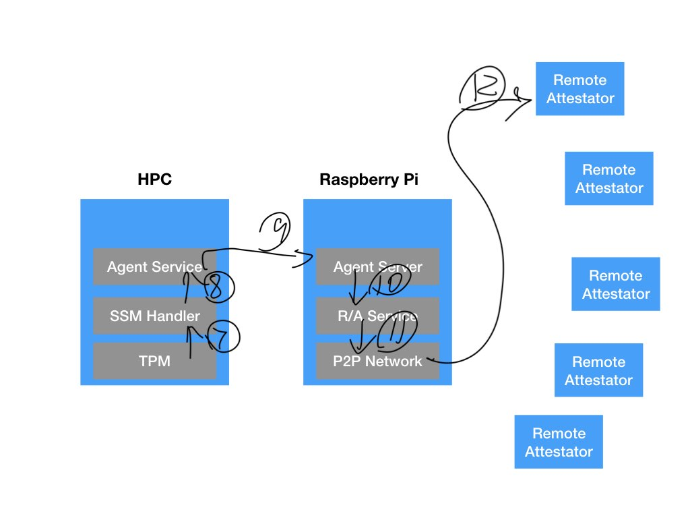

# System Management Mode(SMM) Agent Feasibilty
## Find a Bios programming tools such as [CoreBoot](https://www.coreboot.org/developers.html)
Find a tools such as coreboot, try to get familiar about how the SMM work on a PC. 

Before starting down the SMM lane, [this Intel Whitepaper](https://firmware.intel.com/sites/default/files/resources/A_Tour_Beyond_BIOS_Launching_Standalone_SMM_Drivers_in_PEI_using_the_EFI_Developer_Kit_II.pdf) is a good read.

The overall SMM design use can be seen here:
 

(curtecy Intel)

The primary architecture of Coreboot is:
 
More information can be found [here](https://doc.coreboot.org/getting_started/architecture.html)

Coreboot uses the Linux Kernel [coding style](https://doc.coreboot.org/coding_style.html) and it offers some security features by default:

Coreboot already has (some) support for [SMM](https://review.coreboot.org/c/coreboot/+/2693/2/src/include/cpu/x86/smm.h). The files can be obtained at the [Coreboot github](https://review.coreboot.org/cgit/coreboot.git).

In addition to support for SMM, Coreboot has also inherent Security features build in including the ability to statically or dynamically verify code [see here for more details](https://doc.coreboot.org/security/vboot/measured_boot.html)

To begin the prototype implementation using Coreboot, we will start with a simple QEMU implementation and then use supported motherboards to flash their BIOS.
Instructions how to start with Coreboot and QEMU can be found [here](https://doc.coreboot.org/lessons/lesson1.html)

To deploy on real hardware, we will also need tools to program the BIOS including [Flashrom](https://www.flashrom.org)
The [supported hardware](https://www.flashrom.org/Supported_hardware) includes many supported recent mainboards and mobile devices too!
Maybe we will need to purchase anexternal flasher/programmers to program the BIOS. Some Mainboards do support programming otherwise this list of [programmers](https://www.flashrom.org/Supported_programmers)
will do.

## Agent communicate with TPM
Send command to TPM and get response.
## Agent communicate with Agent Services on PC
Agent services is running on PC after system boot from PXE.
It will respond to RPI's agent server's request, then generate a command to Agent inside SMM

This experiment will test the Agent Service can request an interupt to lunch the Agent handler inside SMM. A simple hello world would be fine.

## Agent communicate with RPi Agent server on RPi
When Agent handler execute, try to send a message to RPi. a hello world would be fine.

The dataflow will be something like this:
RPI Agent Server -- trigger --> HPC's Agent Service -- trigger --> HPC's Agent in SMM -- execute commmand (with TPM likely) and send result to --> RPI Agent server. 

As far as I know the SMM handler is passive, it could not active create an event. Please correct me if I am wrong.

## Remote Attestation Workflow

Step1:
Few VRF selected remote attestator initialize a remote attestation process. It generate a request, for example, it want to get the PCR of a HPC. It send the request to the RaspberryPi via P2P network. The payload including 

- VRF verification information, so that the RPi will verify this is actually a real attestator
- Request command, eg. PCR
- nonce, in order to prevent replay attack
- Signature

Step2:
RPi carrier received the request via P2P network. It verify signature, if failed drop the request.
If success send to R/A Service (remote attestation service). R/A service will do VRF verfication to make sure this node is actaully VRF selected. If this is not valid, it drop the request, also submit a dispute to Layer 1 blockchain smart contract if the signaure valid and VRF failed. (this mean the node is real but it try to pretent VRF selected validator).

If success, it send the request to Agent Server

Step 3:
Agent Server has TCP/IP connection to the Agent Service running inside HPC. 
Agent server just pass the request to the Agent service with a nonce. This nonce is different than the one from remote attestator. It is a new nonce just used between the RPi and HPC. the original nonce from the remote attestor will be stored at R/A Service layer and will be used when return to remote attestator.

Step 4:
Agent Server send the request with the new nonce to Agent Service via regular REST API (or any TCP/IP connection, doesn't have to be REST)

Step 5:
Agent service call a SMI (System Management Interupt). This is cause an hardware interrupt (is this doabe?) to force CPU enter SMM (System Managerment Mode). The handler of this SMI will be execute. This handler was originally load into SMRAM (System Management RAM by BIOS at booting).

Step 6:
The SMI handler executed by CPU and call TPM 2.0 TSS API to TPM, asking for the PCR based on the requrement from Agent Service (eventually from Remote attestator). 

Step 7:
TPM response the PCR values stored in TPM during booting. Sign the data with endorsement key.

Step 8:
SMM handler use RSM instructor leave SMM back to OS, leave the data back to Agent Service.

Step 9:
Agent server response the REST call back to Agent Server at RPI

Step 10:
Agent server return R/A Service

Step 11:
R/A service use P2P network to prepare the response back to remote attestator. Including the original nonce and sign with RPi's public key

Step 12:
P2P network send to Remote Attestator.

The Remote attestors will get to a consensus but not included in this workflow. We will discuss in another workflow.

## Test SMM Agent will coexist with exsiting BIOS and run without problem when HPC boot

We can send this test to GMU lab to make sure it works.

# HPC TPM

## TPM 2.0 command test
Try to use TPM2.0 TSS APi to communicate with HPC's TPM, make sure the response is correct

## Log correct PCR and response when Agent request
When system boot, record PCR. 
when Agent request, generate signed PCR back to agent.

# PXE Booting experiment
Setup DHCP server as a docker container in RPi.
Install PXE server as a docker container in RPi. 
Set HPC boot from LAN. 
Physically connect RPi to HPC using Ethernet
Expect HPC can get IP address from RPi's DHCP. 
Expect HPC to boot from RPi's PXE server.

# USB Booting experiment
RPI Zero Single Board Computer to put into a USB thumb drive interface.
HPC can boot from this USB thumb drive.
RPI Zero can dynamically create the content in the volumn in the USB drive. 

In this case, the HPC can boot everytime from USB drive with different hash of OS image. "Nonce"
This Hash is supposed to be recorded into HPC's PCR, and then be send to RPi remote attestor upon request

# Carrier P2P network between RPis
Run Elastos Carrier (or other platform which can offer similiar features) in docker container.
they can send receive messages, add/remove friends.

# Carrier P2P network with placeholder Proof of Trust
Add a placeholder in Carrier. Only handshake when new join node can provide some kind of proof of trust.
Do not consensus yet, just a placeholder. The place holder could be check the blockchain and allow connect if the node is registered as "good node". 

# Expandable Proof of Trust evaluation function
A score system based on the information coming from TPM and Agent to determine if a node is trustable.

This function should be easy to upgrade. Sounce code should be in IPFS and update easily with replacement new hash.

In the experiment stage, we can starts simple and stupid. Exhance in the future.

# PBFT consensus between Carrier nodes and smart contract
Selected nodes (in the future using VRF) to run PBFT to decide is a node is trustable. If yes, sign and call layer-1 smart contract to set the new node "trust" property and allow to join the network.

